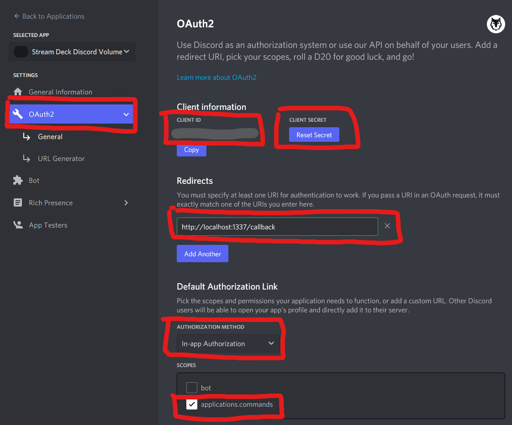

# Stream Deck Discord Volume Mixer
This is a plugin for Stream Deck for managing Discord Voice chats:
* Shows list of people in your voice chat.
* You can **adjust volume** for each user.
* You can **mute** each user by clicking on his name button.
* **Indication** when a user is **speaking**.
* **Self mute and deafen** buttons (deafen only on XL, mute on XL and STD)
* Supports **Standard, Mini, XL and Mobile Decks**.
* You can adjust the audio mixer panel to your needs, it's quite modular - you can move buttons around etc.
* Tested on W10x64.

### Support
* **!!! First read Configuration below !!!**
* If the plugin does not work:
   * Try uninstalling and reinstalling it.
   * Make sure you're not running the Discord or the Stream Deck software with administrator privileges.
   * If that does not help, you can report the problem by following [these steps](DIAGNOSTICS.md).

* If you have some feedback, ask around on [Stream Deck Labs Discord server](https://discord.com/invite/294BQE6Xdp) on the `#danols-plugin-support` channel.
* If you really feel like giving me some money, you can use [PayPal](https://www.paypal.com/donate/?hosted_button_id=QZC5P67TBTRX6).

## Configuration
1. Download and install the plugin.
2. Add the "Discord Volume Mixer" button on your deck.
3. Go to the [Discord developer portal](https://discordapp.com/developers) (if the link asks you for login and then shows the Discord app, close the window and click this link again) and create an application.
   * **You must use the same account in to the Developer portal as in your Discord application, otherwise it won't work.** (You can add the other account as app tester though.)
   * You're setting this stuff up for your own account, not for any bot or anything else.
4. In the Oauth2 settings, set the redirect URI to `http://localhost:1337/callback`
5. Hit "Save changes".
6. From the OAuth2 tab, copy `Client ID` and `Client secret` and paste it in your Discord Volume Mixer button settings (the button used to access the volume mixer).
7. Click on the Discord Volume Mixer button. Discord will ask you for some permissions & firewall and stuff.
8. Done.

**Don't play with the configuration of the buttons in the Volume Mixer profile unless you know what you're doing.**

## Third-party libraries, credits
* Qt 6 (tested on Qt 6.2.1 MSVC 2019 Win x64)
* [QtStreamDeck](https://github.com/CZDanol/QtStreamDeck) for Stream Deck control (copy of [alexandarZ / ElgatoStreamDeck-QtPluginBase](https://github.com/alexandarZ/ElgatoStreamDeck-QtPluginBase), but I adjusted some stuff).
* [QtDiscordIPC](https://github.com/CZDanol/QtDiscordIPC/) for Discord control (IPC through QLocalSocket).
* [Icons8 icons](https://icons8.com/)

### Credits
* Big cudos to [Krabs](https://github.com/krabs-github) for helping me out with profiles for the XL version and testing.

## TODO
* QtStreamDeck create subfolder (for easier including)
* Add mobile support
* Volume increase step also in the global settings
