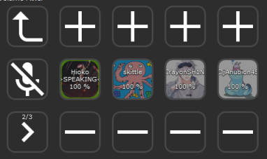

# Stream Deck Discord Volume Mixer
This is a plugin for Stream Deck that allows setting volume for individual users in Discord Voice chat.

* You can adjust the audio mixer panel to your needs, it's quite modular - you can move buttons around etc.
* Tested on W10x64.
* Currently natively support only the 15-key deck. Though it should not be a big issue to create your own deck.

## Configuration
1. Download and install the plugin.
2. Add the "Discord Volume Mixer" button on your deck.
3. Go to the [Discord developer portal](https://discordapp.com/developers) and create an application.
4. In the Oauth2 settings, set the redirect URI to `http://localhost:1337/callback`
5. Hit "Save changes".
6. From the OAuth2 tab, copy `Client ID` and `Client secret` and paste it in the deck button details.
7. Click on the deck button. Discord will ask you for some permissions & firewall and stuff.
8. Done.

## Third-party libraries & stuff
* Qt 6 (tested on Qt 6.2.1 MSVC 2019 Win x64)
* I copied a bunch of Stream Deck control functionality from [alexandarZ / ElgatoStreamDeck-QtPluginBase](https://github.com/alexandarZ/ElgatoStreamDeck-QtPluginBase), though I adjusted it.
* Uses my [QtDiscordIPC](https://github.com/CZDanol/QtDiscordIPC/) for Discord control.
* Icons8 icons
* Communicates with Discord via IPC through QLocalSocket.

## TODO
* Add support for the S and XL variants of stream deck (it's just a matter of creating a profiles for them).

## Donations
If you feel like giving me some money, you can use [PayPal](https://www.paypal.com/donate/?hosted_button_id=QZC5P67TBTRX6).
